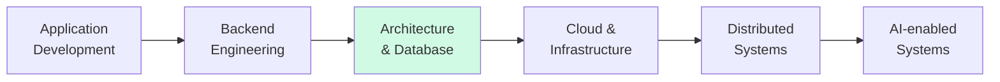
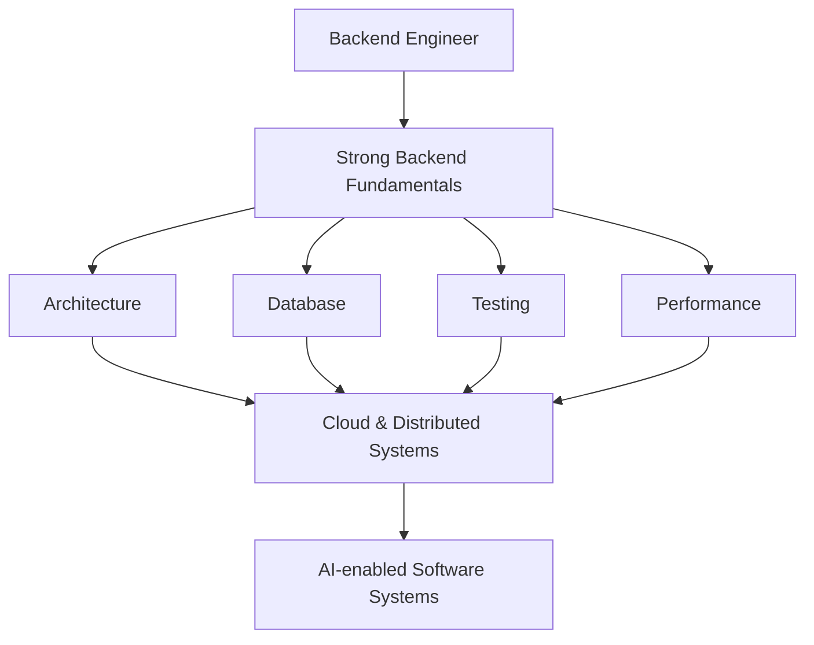

<div align="center">

# Hi, I'm TAEGWAN HONG 👋

### Backend Engineer based in Japan 🇯🇵

Building backend systems with a focus on  
**Architecture · Data · Maintainability · Automation**

<br>


</div>

---

## 👨‍💻 About Me

I'm a software engineer based in Japan, primarily focused on **backend engineering**.

I enjoy understanding not only how to make software work, but also **why systems are designed the way they are** — how responsibilities should be separated, how data should flow through an application, how failures should be handled, and how software can remain maintainable as it grows.

My experience spans several technology stacks and development environments:

- 🏗️ Backend development with **C# / .NET**
- ☕ Web application development with **Java**
- 🌐 Full-stack development with **TypeScript / JavaScript**
- 🐍 Backend and AI development with **Python**
- 💎 API development with **Ruby on Rails**
- 🗄️ Relational databases and ORM-based persistence
- 🐳 Containerized development environments
- ☁️ Cloud infrastructure fundamentals
- 🤖 Machine Learning, Deep Learning, and Generative AI
- 👥 Individual and team-based software development

I'm currently strengthening my backend engineering fundamentals while gradually expanding toward **cloud infrastructure, distributed systems, system design, and AI-enabled software**.

---

## 🎯 Current Focus

### Backend Engineering

`C#` · `.NET` · `ASP.NET` · `Java` · `TypeScript` · `SQL`

### Currently Deepening

`Backend Architecture` · `Database Design` · `Testing` · `Docker` · `Cloud`

### Exploring

`Distributed Systems` · `System Design` · `AI Engineering` · `Performance`

---

# 🚀 Featured Projects

## 🏗️ Dotnet Backend Study

> Evolving a simple ASP.NET MVC CRUD application into a structured and maintainable backend system.

The project is developed incrementally to understand why common backend patterns and infrastructure components are introduced.

### Engineering Focus

`Architecture` · `Persistence` · `Dependency Injection` · `Testing` · `Maintainability`

### Implemented

- Controller / Service / Repository architecture
- Repository abstraction
- Unity Dependency Injection
- Entity Framework 6
- SQL Server LocalDB
- Code First Migrations
- Service-layer validation
- Global Exception Handling
- HTTP 400 / 404 / 500 handling
- AutoMapper
- log4net
- MSTest
- Vue.js integration

### Stack

`C#` `ASP.NET MVC 5` `.NET Framework 4.8` `EF6` `SQL Server` `Vue.js`

➡️ [View Project](https://github.com/lemonwasp/dotnet-study)

---

## 👥 Tsunagaroom

> A team-developed web application designed to help seniors and their families stay connected through asynchronous video communication.

The system allows family videos to be delivered to senior users while reaction videos can be recorded and returned.

### Engineering Focus

`Application Design` · `Backend Flow` · `Database Design` · `Team Development`

### My Role

- Application and backend flow design
- Database structure design
- Video retrieval logic
- Reaction recording workflow
- Servlet / JSP application design
- Specification coordination within the team

### Stack

`Java` `JSP` `Servlet` `JavaScript` `SQL`

🚧 **Repository reconstruction in progress**

---

## 🤖 AI Training Project — Germany

> Applied AI work completed during an intensive AI training program in Germany.

The training covered the progression from traditional machine learning to deep learning and Generative AI.

### Topics

**Machine Learning**

`K-Means` · `KNN` · `Logistic Regression` · `Decision Tree` · `Random Forest`

**Deep Learning**

`PyTorch` · `CNN` · `RNN` · `Transformer`

**Generative AI**

`Azure OpenAI` · `LangChain`

🏆 **Hackathon winning team**

🚧 **Project repository reconstruction in progress**

---

## 🌐 Modern Web Projects

### 📍 Let Eat Go

> A location-based web application exploring modern TypeScript backend and frontend development.

### Engineering Focus

`API Design` · `Geospatial Data` · `Backend Development` · `Containerization`

### Stack

`Next.js` `TypeScript` `NestJS` `PostgreSQL` `PostGIS` `Docker`

🚧 Project documentation / repository organization in progress

---

### 📊 MyFace Tracker

A personal tracking application exploring lightweight Python backend development and data persistence.

**Stack**

`Python` `FastAPI` `SQLite` `Supabase`

➡️ [View Project](https://github.com/lemonwasp/myface-tracker)

---

### 💎 Rails + Vue Blog

An API-oriented web application built to practice separation between a backend API and frontend SPA.

**Stack**

`Ruby on Rails` `Vue.js` `REST API`

➡️ [View Project](https://github.com/lemonwasp/Ruby-Vuejs-blog)

---

# 🧰 Tech Stack

> Technologies I have used across personal projects, team projects, training, and development practice.

## 💻 Languages

<p>
  
</p>

`C#` · `Java` · `TypeScript` · `JavaScript` · `Python` · `Ruby` · `SQL`

---

## ⚙️ Backend

<p>
  
</p>

### .NET

`ASP.NET MVC 5` · `.NET Framework 4.8` · `Entity Framework 6` · `LINQ`  
`Unity` · `AutoMapper` · `log4net`

### Java

`JSP` · `Servlet`

### TypeScript / JavaScript

`Node.js` · `NestJS`

### Python

`FastAPI`

### Ruby

`Ruby on Rails` · `Rails API`

---

## 🎨 Frontend

<p>
  
</p>

`React` · `Vue.js` · `Next.js` · `TypeScript`  
`Vite` · `Tailwind CSS` · `Razor` · `HTML` · `CSS` · `Fetch API`

---

## 🗄️ Database & Data

<p>
  
</p>

### Relational Databases

`PostgreSQL` · `SQL Server` · `MySQL` · `SQLite` · `TiDB`

### Data / Extensions

`PostGIS` · `Supabase`

### Cache / Search

`Redis` · `Meilisearch`

### ORM / Persistence

`Entity Framework 6` · `Rails Active Record`

---

## ☁️ Cloud & Infrastructure

<p>
  
</p>

`Docker` · `AWS` · `Azure` · `Linux` · `WSL`

Experience / practice includes:

`Amazon VPC` · `Amazon EKS` · `Azure OpenAI`

---

## 🤖 AI / Machine Learning

<p>
  
</p>

### Machine Learning

`K-Means` · `KNN` · `Logistic Regression`  
`Decision Tree` · `Random Forest`

### Deep Learning

`PyTorch` · `CNN` · `RNN` · `Transformer`

### Generative AI

`Azure OpenAI` · `LangChain`

---

## 🧪 Testing & Automation

`MSTest` · `Selenium` · `GitHub Actions`

Areas of interest:

`Unit Testing` · `Integration Testing` · `Test Automation` · `CI/CD`

---

## 🔧 Development & Collaboration

<p>
  
</p>

`Git` · `GitHub` · `Bitbucket`  
`Visual Studio` · `VS Code` · `Eclipse`

Development practices:

`GitHub Issues` · `Feature Branches` · `Pull Requests` · `Code Review`

---

# 🧭 Engineering Journey



My current focus is moving from simply implementing features toward understanding the larger engineering concerns around them.

```text
Feature Implementation
        ↓
Application Architecture
        ↓
Database & Persistence
        ↓
Testing & Reliability
        ↓
Performance
        ↓
Cloud Infrastructure
        ↓
Distributed Systems
        ↓
AI-enabled Systems
```

---

# 🌍 International Experience

My development and learning experience has included environments across multiple countries.

🇰🇷 **Korea** — Education and software development  
🇯🇵 **Japan** — Software engineering and technical training  
🇩🇪 **Germany** — AI training and hackathon  
🇷🇴 **Romania** — International experience

Working across different environments has strengthened my interest in building software that can operate across teams, technologies, and cultures.

---

# 🗣️ Languages

| Language | Level |
|---|---|
| 🇰🇷 Korean | Native |
| 🇯🇵 Japanese | Professional |
| 🇬🇧 English | Improving |

---

# 📚 Currently Learning

### Backend

`ASP.NET` · `Architecture` · `Database` · `Async Programming`

### Infrastructure

`Docker` · `CI/CD` · `AWS` · `Cloud Architecture`

### Computer Science

`Algorithms` · `Linear Algebra` · `Optimization` · `Data Analysis`

### AI

`AI Agents` · `LLM Applications` · `AI-assisted Software Engineering`

---

# 📈 Direction



My long-term technical direction is to combine strong backend fundamentals with cloud infrastructure and applied AI.

---

# 💡 Engineering Philosophy

I prefer learning technologies by integrating them into real applications rather than studying them only in isolation.

When introducing a new technology or architectural pattern, I try to answer:

> **Why is it needed?**  
> **What problem does it solve?**  
> **Where should it belong?**  
> **What trade-offs does it introduce?**

I value incremental improvement:

```text
Build
  ↓
Find a limitation
  ↓
Understand the problem
  ↓
Introduce a solution
  ↓
Test
  ↓
Refactor
  ↓
Repeat
```

My goal is to grow into an engineer who understands both **implementation details and the larger systems around them**.

---

<div align="center">

### Thanks for visiting 👋

**Backend · Cloud · AI · System Design**

</div>
