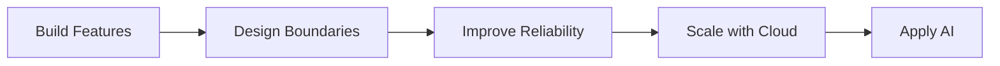

# Hi, I'm Taegwan Hong 👋

### Backend Engineer based in Japan 🇯🇵

Building backend systems with a focus on
**Architecture · Data · Reliability · Automation**

 

---

## 👨‍💻 About Me

Backend-focused software engineer interested in understanding not only how software works, but **why systems are designed the way they are**.

I improve real applications through small, reviewable changes while deepening my understanding of architecture, databases, testing, reliability, and automation.

|                       |                                                  |
| --------------------- | ------------------------------------------------ |
| 📍 **Based in**       | Japan                                            |
| 🧭 **Direction**      | Backend Engineering                              |
| 🔧 **Focus**          | Architecture · Databases · Testing · Reliability |
| 🚀 **Growing Toward** | Cloud · Distributed Systems · Applied AI         |
| 🌍 **Languages**      | Korean · Japanese · English · Romanian           |

---

# 🚀 Featured Projects

## 🏗️ Dotnet Backend Study

> Evolving a simple ASP.NET MVC CRUD application into a structured and maintainable backend system.

Incrementally improving an existing application to understand backend architecture and infrastructure through practical implementation.

### Engineering Focus

`Architecture` · `Persistence` · `Testing` · `Error Handling` · `Maintainability`

### Implemented

* Controller → Service → Repository architecture
* Repository abstraction and Unity Dependency Injection
* Entity Framework 6 · SQL Server LocalDB · Code First Migrations
* DTO / Entity separation and AutoMapper
* Service-layer validation and global exception handling
* Application logging with log4net
* MSTest service-layer unit tests
* Server-side pagination with boundary validation
* Vue.js frontend integration

✅ **Current:** Server-side pagination completed
➡️ **Next:** Search / Filtering

Development trail:
[Issue #26](https://github.com/lemonwasp/dotnet-study/issues/26) → [PR #27](https://github.com/lemonwasp/dotnet-study/pull/27)

`C#` · `ASP.NET MVC 5` · `.NET Framework 4.8` · `EF6` · `SQL Server` · `Vue.js` · `MSTest`

➡️ [Explore Dotnet Backend Study](https://github.com/lemonwasp/dotnet-study)

---

## 👥 Tsunagaroom

> Helping seniors and their families stay connected through asynchronous video communication.

A Java/JSP team project that delivers family videos to senior users and automatically records their reactions during playback.

### My Contributions

* Designed playback ↔ automatic reaction-recording interaction
* Structured the Servlet → Logic → DAO processing flow
* Designed unread/read video-state management
* Implemented and reviewed parts of the recording/upload workflow
* Participated in screen and server-processing design
* Coordinated implementation decisions and team reviews

The public repository also separates runtime data and secrets from source control through environment-based configuration and repository hygiene practices.

`Java 21` · `Jakarta Servlet` · `JSP` · `JavaScript` · `MySQL 8` · `Tomcat 10`

➡️ [Explore Tsunagaroom](https://github.com/lemonwasp/tsunagaroom)

---

## 🤖 AI Lead Conversion Platform

> Reconstructing a 2024 AI hackathon prototype as a privacy-safe and reproducible software project.

An independent reconstruction using synthetic CRM data, focused on reproducible machine-learning workflows, privacy boundaries, and human-reviewed AI-assisted systems.

### Current Progress

* Documented public/private data boundaries
* Added a minimal FastAPI health endpoint and automated test
* Reconstructed historical lead/note data shapes and join relationships
* Documented the public aggregate CRM profile
* Built a privacy-safe synthetic data generator calibrated to observed aggregate behavior

🚧 **Current:** Phase 1 — calibrated synthetic data foundation
➡️ **Next:** leakage-safe preprocessing · reproducible EDA · model baselines

### Engineering Direction

* Leakage-safe ML evaluation
* Reproducible data and feature pipelines
* FastAPI prediction and explanation endpoints
* React + TypeScript dashboard
* Human-reviewed LLM-assisted outreach
* Docker · automated tests · CI

➡️ [Follow the Reconstruction](https://github.com/lemonwasp/ai-lead-conversion-platform)

---

# 🧰 Technology

### Backend & Data

`C#` · `.NET` · `Java` · `TypeScript` · `Python`
`ASP.NET MVC` · `Entity Framework` · `Jakarta Servlet`
`NestJS` · `FastAPI` · `Ruby on Rails`
`SQL Server` · `PostgreSQL` · `MySQL` · `SQLite`

### Frontend

`Vue.js` · `React` · `Next.js` · `Vite` · `Tailwind CSS`

### Infrastructure & Quality

`Docker` · `AWS` · `Azure` · `Linux`
`MSTest` · `Selenium` · `GitHub Actions`

`GitHub Issues` · `Feature Branches` · `Pull Requests`
`Code Review` · `Incremental Refactoring`

### AI / ML

`PyTorch` · `CNN` · `RNN` · `Transformer`
`K-Means` · `KNN` · `Logistic Regression` · `Random Forest`
`Azure OpenAI` · `LangChain`

---

# 🧭 Engineering Journey

My current direction is moving from feature implementation toward understanding the **architecture, reliability, data, and infrastructure behind software systems**.

---

# 🌍 Global Experience

| Country             | Experience                                                  |
| ------------------- | ----------------------------------------------------------- |
| 🇯🇵 **Japan**      | Software engineering career                                 |
| 🇩🇪 **Germany**    | AI training · ML/DL · Azure OpenAI · Hackathon winning team |
| 🇺🇿 **Uzbekistan** | International internship                                    |
| 🇷🇴 **Romania**    | Independent stay · Romanian language learning               |
| 🇰🇷 **Korea**      | Software engineering education and projects                 |

---

# 🗣️ Languages

| Language      | Level                  |
| ------------- | ---------------------- |
| 🇰🇷 Korean   | Native                 |
| 🇯🇵 Japanese | Professional · JLPT N1 |
| 🇬🇧 English  | TOEIC Speaking AL      |
| 🇷🇴 Romanian | Beginner               |

---

# 💡 Engineering Philosophy

I prefer learning technologies by applying them to real systems and understanding **why they are needed**.

I value incremental improvement:

**Build → Find limitations → Understand → Improve → Test → Review → Repeat**

My goal is to understand both **implementation details and the larger systems around them**.
