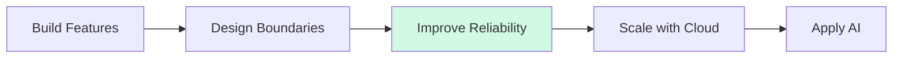

# Hi, I'm Taegwan Hong 👋

### Backend Engineer based in Japan 🇯🇵

Building backend systems with a focus on
**Architecture · Data · Reliability · Automation**

 

 

> From implementing features to understanding
> the architecture, data, and systems behind them.

---

## 👨‍💻 About Me

I'm a software engineer based in Japan, primarily focused on **backend engineering**.

I enjoy understanding not only how to make software work, but also why systems are designed the way they are.

I prefer learning technologies by integrating them into real applications and improving those applications through small, reviewable changes.

|                       |                                                  |
| --------------------- | ------------------------------------------------ |
| 📍 **Based in**       | Japan                                            |
| 🧭 **Core Direction** | Backend Engineering                              |
| 🔧 **Current Focus**  | Architecture · Databases · Testing · Reliability |
| 🚀 **Growing Toward** | Cloud · Distributed Systems · Applied AI         |

---

## 🎯 Current Focus

| Area                    | Focus                                              |
| ----------------------- | -------------------------------------------------- |
| **Backend Engineering** | C# · .NET · Java · TypeScript · SQL                |
| **Deepening**           | Architecture · Database Design · Testing · CI/CD   |
| **Expanding Into**      | Cloud Infrastructure · Performance · Observability |
| **Exploring**           | Distributed Systems · AI-enabled Software          |

---

# 🚀 Featured Projects

## 🏗️ Dotnet Backend Study

> Evolving a simple ASP.NET MVC CRUD application into a structured and maintainable backend system.

This project is an incremental backend refactoring study focused on understanding why architecture and infrastructure components are introduced.

### Engineering Focus

`Architecture` · `Persistence` · `Dependency Injection`
`Testing` · `Error Handling` · `Maintainability`

### Implemented

* Controller → Service → Repository architecture
* Repository abstraction and Unity Dependency Injection
* Entity Framework 6 + SQL Server LocalDB
* Code First Migrations
* DTO / Entity separation with AutoMapper
* Service-layer validation
* Global HTTP 400 / 404 / 500 exception handling
* Application logging with log4net
* MSTest service-layer unit tests
* Server-side pagination with validation and boundary handling
* Vue.js frontend integration

**Current:** Server-side pagination completed
**Next:** Search / Filtering

Development trail:

[Issue #26](https://github.com/lemonwasp/dotnet-study/issues/26)
→ [Merged PR #27](https://github.com/lemonwasp/dotnet-study/pull/27)

➡️ [Explore Dotnet Backend Study](https://github.com/lemonwasp/dotnet-study)

---

## 👥 Tsunagaroom

> Helping seniors and their families stay connected through asynchronous video communication.

An **8-member Java/JSP team project** where I primarily contributed as a **development / system design member**.

### My Role

* Designed application and server-side processing flows
* Structured the Servlet → Logic → DAO processing model
* Designed video playback and automatic reaction-recording behavior
* Defined unread / read state processing rules
* Created implementation specifications
* Designed functional, boundary, and exception test cases
* Reviewed implementation against agreed specifications
* Coordinated design and specification decisions within the team

The public repository also separates credentials and runtime-generated data from source control through environment-based configuration and repository hygiene practices.

### Stack

`Java 21` · `Jakarta Servlet` · `JSP`
`JavaScript` · `MySQL 8` · `Apache Tomcat 10`

➡️ [Explore Tsunagaroom](https://github.com/lemonwasp/tsunagaroom)

---

## 🍽️ Let Eat Go

> A social dining platform connecting people through shared meals and local events.

A **4-member team project** built as separate frontend, backend, and AI-service repositories.

### My Contributions

* Initial entity design
* Authentication flow
* Album backend
* Chat-room entity relationships
* Comment DTO fixes
* S3 image deletion behavior

### Platform Highlights

* Next.js frontend and NestJS backend
* PostgreSQL + TypeORM persistence
* JWT and Google / Kakao OAuth
* Real-time chat with Socket.IO
* AWS S3 image handling
* FastAPI AI-service integration
* Docker and GitHub Actions
* AWS ECS / ECR deployment workflow

### Stack

`Next.js` · `React` · `TypeScript` · `NestJS`
`PostgreSQL` · `TypeORM` · `FastAPI`
`Docker` · `AWS` · `GitHub Actions`

➡️ [Frontend Repository](https://github.com/YJU-5/project-leteatgo-nextjs-repo)
➡️ [Backend Repository](https://github.com/YJU-5/project-leteatgo-nestjs-repo)

---

## 🤖 AI Lead Conversion Platform

> Reconstructing a 2024 AI hackathon prototype as a privacy-safe and reproducible software project.

The current repository is an independent reconstruction using synthetic CRM data and does not contain the original corporate dataset or proprietary source files.

### Current Progress

* Public / private data boundaries documented
* FastAPI health endpoint and automated test added
* Historical lead / note data relationships reconstructed
* Public aggregate CRM profile documented
* Privacy-safe synthetic data generator calibrated to observed aggregate behavior

### Engineering Goals

* Leakage-safe machine-learning evaluation
* Reproducible preprocessing and feature pipelines
* Prediction and explanation APIs
* React / TypeScript dashboard
* Human-reviewed LLM-assisted outreach
* Automated tests, Docker, and CI

🚧 **Current phase:** calibrated synthetic data foundation
➡️ **Next:** leakage-safe preprocessing · reproducible EDA · model baselines

➡️ [Follow the Reconstruction](https://github.com/lemonwasp/ai-lead-conversion-platform)

---

# 🧰 Technology Landscape

## ⭐ Core Technologies

  

---

## ⚙️ Backend & APIs

  

  
  
  
  

---

## 🎨 Frontend

  

---

## 🗄️ Database & Data

  

  
  

---

## ☁️ Infrastructure & Quality

  

  
  
  

---

## 🤖 AI & Machine Learning

  

  
  
  

---

# 🧭 Engineering Journey

My current focus is moving from simply implementing features toward understanding the larger engineering concerns around them.

---

# 🌍 Global Experience

> Learning, working, and adapting across different countries and cultures.

| Country             | Experience                                                                                      |
| ------------------- | ----------------------------------------------------------------------------------------------- |
| 🇯🇵 **Japan**      | Software engineering career · Japanese IT environment                                           |
| 🇩🇪 **Germany**    | 1-month intensive AI training · ML, Deep Learning, Azure OpenAI · Hackathon winning team        |
| 🇺🇿 **Uzbekistan** | 1-week international internship · Cross-cultural professional experience                        |
| 🇷🇴 **Romania**    | 1-month independent stay · Romanian language learning · Everyday life in a European environment |
| 🇰🇷 **Korea**      | Software engineering education · Team and personal development projects                         |

These experiences have strengthened my adaptability, cross-cultural communication, and ability to work in unfamiliar environments.

---

# 🗣️ Languages

| Language      | Level                                      |
| ------------- | ------------------------------------------ |
| 🇰🇷 Korean   | Native                                     |
| 🇯🇵 Japanese | Professional working proficiency · JLPT N1 |
| 🇬🇧 English  | TOEIC Speaking AL                          |
| 🇷🇴 Romanian | Beginner · Currently learning              |

---

# 💡 Engineering Philosophy

I prefer learning technologies by integrating them into real applications rather than studying them only in isolation.

When introducing a new technology or architectural pattern, I try to understand:

> **Why is it needed?**
> **What problem does it solve?**
> **Where should it belong?**
> **What trade-offs does it introduce?**

I value incremental improvement:

**Build → Find a limitation → Understand → Improve → Test → Review → Repeat**

My goal is to grow into an engineer who understands both **implementation details and the larger systems around them**.

---

### Thanks for visiting 👋

**Backend · Reliability · Cloud · Applied AI · Global Collaboration**

