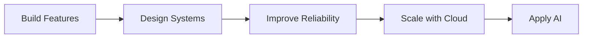

<div align="center">

# Hi, I'm Taegwan Hong 👋

### Backend Engineer based in Japan 🇯🇵

**Architecture · Data · Reliability · Automation**

<br>


</div>

---

## 👨‍💻 About

Backend-focused software engineer interested in understanding not only **how software works**, but **why systems are designed the way they are**.

I improve real applications through incremental, reviewable changes while deepening my understanding of architecture, databases, testing, reliability, and infrastructure.

|                       |                                             |
| --------------------- | ------------------------------------------- |
| 📍 **Based in**       | Japan                                       |
| 🔧 **Focus**          | Backend · Architecture · Data · Reliability |
| 🚀 **Growing Toward** | Cloud · Distributed Systems · Applied AI    |
| 🌍 **Languages**      | Korean · Japanese · English · Romanian      |

---

# 🚀 Featured Projects

## 🏗️ Dotnet Backend Study

> Turning a basic ASP.NET MVC CRUD application into a maintainable backend system.

|               |                                                    |
| ------------- | -------------------------------------------------- |
| 🎯 **Focus**  | Architecture · Persistence · Testing · Reliability |
| ✅ **Current** | Server-side pagination completed                   |
| ➡️ **Next**   | Search / Filtering                                 |
| 🛠️ **Stack** | C# · ASP.NET MVC 5 · EF6 · SQL Server · Vue.js     |

### Key Improvements

* Controller → Service → Repository architecture
* Repository abstraction and Unity Dependency Injection
* Entity Framework 6 + SQL Server LocalDB
* Code First Migrations
* DTO / Entity separation with AutoMapper
* Service-layer validation
* Global HTTP exception handling
* log4net application logging
* MSTest service-layer unit tests
* Server-side pagination with boundary handling

**Engineering trail:**
[Issue #26](https://github.com/lemonwasp/dotnet-study/issues/26) → [PR #27](https://github.com/lemonwasp/dotnet-study/pull/27)

➡️ [Explore Dotnet Backend Study](https://github.com/lemonwasp/dotnet-study)

---

## 👥 Tsunagaroom

> Asynchronous video communication for seniors and their families.

|               |                                                |
| ------------- | ---------------------------------------------- |
| 👥 **Type**   | 8-member Team Project                          |
| 🎯 **Role**   | Development / System Design                    |
| 🧩 **Scope**  | Processing Flow · Specifications · Test Design |
| 🛠️ **Stack** | Java 21 · JSP · Servlet · MySQL · JavaScript   |

### My Contributions

* Designed application and server-side processing flows
* Structured Servlet → Logic → DAO responsibilities
* Designed video playback ↔ automatic reaction-recording behavior
* Defined unread / read video-state processing
* Created development specifications for implementation
* Designed functional, boundary, and exception test cases
* Reviewed implementation against specifications
* Coordinated design and specification decisions within the team

```text
Requirements
     ↓
Development Design
     ↓
Specification
     ↓
Implementation
     ↓
Test Design
     ↓
Verification
```

The public repository also separates credentials and runtime-generated data from source control through environment-based configuration and repository hygiene practices.

➡️ [Explore Tsunagaroom](https://github.com/lemonwasp/tsunagaroom)

---

## 🍽️ Let Eat Go

> A social dining platform connecting people through shared meals and local events.

|                       |                                          |
| --------------------- | ---------------------------------------- |
| 👥 **Type**           | 4-member Team Project                    |
| 🎯 **Focus**          | Backend · Full-stack Integration · Cloud |
| 🧩 **Architecture**   | Next.js · NestJS · FastAPI · PostgreSQL  |
| ☁️ **Infrastructure** | Docker · AWS ECS/ECR/S3 · GitHub Actions |

### Platform

```text
Next.js Web Client
        ↓ REST / JWT
NestJS Backend API
   ↙       ↓       ↘
PostgreSQL  S3   FastAPI AI
        ↕
    Socket.IO
```

### My Contributions

* Contributed to the initial entity design
* Worked on authentication flow
* Implemented parts of the album backend
* Worked on chat-room entity relationships
* Fixed Comment DTO behavior
* Improved S3 image deletion behavior

### Engineering Environment

`JWT Authentication` · `Google / Kakao OAuth` · `Socket.IO`
`TypeORM` · `PostgreSQL` · `AWS S3` · `Swagger`
`Docker` · `GitHub Actions` · `AWS ECS / ECR`

The project uses separate **frontend, backend, and AI-service repositories** with an issue / PR-based team workflow.

➡️ [Frontend](https://github.com/YJU-5/project-leteatgo-nextjs-repo)
➡️ [Backend API](https://github.com/YJU-5/project-leteatgo-nestjs-repo)

---

## 🤖 AI Lead Conversion Platform

> Privacy-safe reconstruction of a 2024 AI hackathon prototype.

|                |                                                    |
| -------------- | -------------------------------------------------- |
| 🎯 **Focus**   | Reproducible ML · Privacy · AI-assisted Workflows  |
| 🚧 **Current** | Calibrated Synthetic Data Foundation               |
| ➡️ **Next**    | Leakage-safe Preprocessing · EDA · Model Baselines |
| 🛠️ **Stack**  | Python · FastAPI · ML · React · TypeScript         |

### Current Progress

* Documented public / private data boundaries
* Added a FastAPI health endpoint and automated test
* Reconstructed historical lead / note data relationships
* Documented the public aggregate CRM profile
* Built a privacy-safe synthetic generator calibrated to observed aggregate behavior

### Engineering Direction

`Leakage-safe ML Evaluation`
`Reproducible Data Pipelines`
`Prediction & Explanation API`
`React Dashboard`
`Human-reviewed LLM Assistance`

The reconstruction uses synthetic data only and keeps the historical team project clearly separated from the current public implementation.

➡️ [Explore AI Lead Conversion Platform](https://github.com/lemonwasp/ai-lead-conversion-platform)

---

# 🧰 Technology

### Backend

`C#` · `.NET` · `Java` · `TypeScript` · `Python`

`ASP.NET MVC` · `Entity Framework` · `Jakarta Servlet`
`NestJS` · `FastAPI` · `Ruby on Rails`

### Data

`SQL Server` · `PostgreSQL` · `MySQL` · `SQLite`
`TypeORM` · `Entity Framework` · `PostGIS`

### Frontend

`Vue.js` · `React` · `Next.js` · `Vite` · `Tailwind CSS`

### Infrastructure & Quality

`Docker` · `AWS` · `Azure` · `Linux` · `GitHub Actions`

`MSTest` · `Selenium` · `Pull Requests`
`Code Review` · `Incremental Refactoring`

### AI / ML

`PyTorch` · `Transformers` · `CNN` · `RNN`

`K-Means` · `KNN` · `Logistic Regression`
`Random Forest` · `Azure OpenAI` · `LangChain`

---

# 🧭 Engineering Direction



My current direction is moving from feature implementation toward understanding the **architecture, data, reliability, and infrastructure behind software systems**.

---

# 🌍 Global Experience

| Country             | Experience                                               |
| ------------------- | -------------------------------------------------------- |
| 🇯🇵 **Japan**      | Software engineering career                              |
| 🇩🇪 **Germany**    | Intensive AI training · ML/DL · Azure OpenAI · Hackathon |
| 🇺🇿 **Uzbekistan** | International internship                                 |
| 🇷🇴 **Romania**    | Independent stay · Language learning                     |
| 🇰🇷 **Korea**      | Software engineering education and team projects         |

---

# 🗣️ Languages

| Language      | Level                  |
| ------------- | ---------------------- |
| 🇰🇷 Korean   | Native                 |
| 🇯🇵 Japanese | Professional · JLPT N1 |
| 🇬🇧 English  | TOEIC Speaking AL      |
| 🇷🇴 Romanian | Beginner               |

---

# 💡 Engineering Philosophy

**Build → Find limitations → Understand → Improve → Test → Review → Repeat**

I prefer learning technologies by applying them to real systems and understanding **why a technology, architecture, or engineering practice is needed**.

My goal is to understand both **implementation details and the larger systems around them**.
