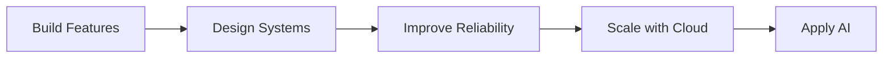

<div align="center">

# Taegwan Hong

### Backend Engineer based in Japan 🇯🇵

**Backend Architecture · Data · Reliability · Automation**

<br>

<p>
  
</p>

> Building systems, understanding their structure, and improving them step by step.

</div>

---

## 👨‍💻 About

Backend-focused software engineer interested in understanding not only **how software works**, but **why systems are designed the way they are**.

I learn through real applications — introducing architecture, persistence, testing, automation, and infrastructure as the system grows.

**Currently:** Backend Engineering → Reliability → Cloud → Applied AI

---

# 🚀 Featured Engineering

## 🏗️ Dotnet Backend Study

> From basic CRUD to maintainable backend architecture.

`Architecture` · `Persistence` · `Testing` · `Reliability`

```text
Basic MVC CRUD
      ↓
Service Layer
      ↓
Repository + DI
      ↓
Database Persistence
      ↓
Validation + Error Handling
      ↓
Testing + Logging
      ↓
Server-side Pagination
```

### Engineering Improvements

* Controller → Service → Repository architecture
* Repository abstraction with Unity Dependency Injection
* Entity Framework 6 + SQL Server LocalDB
* Code First Migrations
* DTO / Entity separation with AutoMapper
* Service-layer validation
* Centralized HTTP exception handling
* log4net application logging
* MSTest service-layer unit tests
* Server-side pagination with boundary handling

**Current:** Pagination ✅ → **Next:** Search / Filtering

[Issue #26](https://github.com/lemonwasp/dotnet-study/issues/26) → [PR #27](https://github.com/lemonwasp/dotnet-study/pull/27)

➡️ [Explore Dotnet Backend Study](https://github.com/lemonwasp/dotnet-study)

---

## 👥 Tsunagaroom

> Asynchronous video communication for seniors and their families.

**8-member Team Project · System / Development Design**

```text
Requirements
     ↓
Development Design
     ↓
Processing Specification
     ↓
Implementation
     ↓
Test Case Design
     ↓
Verification
```

### My Role

* Designed application and server-side processing flows
* Structured Servlet → Logic → DAO responsibilities
* Designed video playback ↔ automatic reaction recording
* Defined unread / read video-state behavior
* Created development specifications for implementation
* Designed functional, boundary, and exception test cases
* Reviewed implementation against specifications
* Coordinated design and specification decisions within the team

The public repository also separates credentials and runtime-generated data from source control through environment-based configuration and repository hygiene practices.

➡️ [Explore Tsunagaroom](https://github.com/lemonwasp/tsunagaroom)

---

## 🍽️ Let Eat Go

> Social dining platform connecting people through shared meals and local events.

**4-member Team Project · Backend / Full-stack Integration**

```text
                 Next.js
                    │
               REST / JWT
                    ↓
                  NestJS
          ┌─────────┼─────────┐
          ↓         ↓         ↓
     PostgreSQL   AWS S3   FastAPI AI
          ↑
      Socket.IO
```

### My Backend Contributions

* Initial entity design
* Authentication flow
* Album backend
* Chat-room entity relationships
* Comment DTO fixes
* S3 image deletion behavior

### Engineering Environment

`JWT / OAuth` · `Socket.IO` · `TypeORM` · `PostgreSQL`
`AWS S3` · `Swagger` · `Docker` · `GitHub Actions` · `AWS ECS / ECR`

Frontend, backend, and AI services are maintained as separate repositories using an issue / PR-based workflow.

➡️ [Frontend](https://github.com/YJU-5/project-leteatgo-nextjs-repo)
➡️ [Backend API](https://github.com/YJU-5/project-leteatgo-nestjs-repo)

---

## 🤖 AI Lead Conversion Platform

> Privacy-safe reconstruction of a 2024 AI hackathon prototype.

`Reproducible ML` · `Privacy` · `Data Engineering` · `AI-assisted Workflows`

```text
Synthetic Data ✅
      ↓
Leakage-safe Pipeline
      ↓
EDA & Model Baselines
      ↓
Prediction / Explanation API
      ↓
React Dashboard
      ↓
Human-reviewed LLM Assistance
```

### Current Progress

* Documented public / private data boundaries
* Added FastAPI health endpoint and automated test
* Reconstructed historical lead / note data relationships
* Documented public aggregate CRM behavior
* Built a privacy-safe synthetic generator calibrated to observed aggregates

**Current:** Calibrated synthetic data foundation
**Next:** Leakage-safe preprocessing · EDA · Model baselines

The reconstruction uses synthetic data only and clearly separates the historical team project from the current public implementation.

➡️ [Explore AI Lead Conversion Platform](https://github.com/lemonwasp/ai-lead-conversion-platform)

---

# 🧰 Technology

### Languages & Backend

<p>
  
</p>

<p>
  
  
  
  
</p>

### Frontend

<p>
  
</p>

### Data

<p>
  
</p>

<p>
  
  
</p>

### Infrastructure & Quality

<p>
  
</p>

<p>
  
  
  
</p>

### AI / ML

<p>
  
</p>

<p>
  
  
  
</p>

---

# 🧭 Engineering Direction



I am moving from feature implementation toward understanding the **architecture, data, reliability, and infrastructure behind software systems**.

---

## 🌍 Beyond Code

**🇰🇷 Korea · 🇯🇵 Japan · 🇩🇪 Germany · 🇺🇿 Uzbekistan · 🇷🇴 Romania**

**Korean** — Native
**Japanese** — JLPT N1
**English** — TOEIC Speaking AL
**Romanian** — Beginner

<br>

> **Build → Understand → Improve → Test → Review → Repeat**

<div align="center">

**Backend · Reliability · Cloud · Applied AI**

</div>
