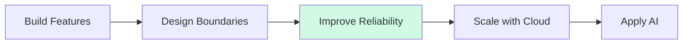

<div align="center">

# Hi, I'm Taegwan Hong 👋

### Backend Engineer based in Japan 🇯🇵

Building backend systems with a focus on  
**Architecture · Data · Reliability · Automation**

<br>


<br>

> From implementing features to understanding  
> the architecture, data, and systems behind them.

</div>

---

## 👨‍💻 About Me

I'm a software engineer based in Japan, primarily focused on **backend engineering**.

I enjoy understanding not only how to make software work, but also why systems are designed the way they are:

- How should responsibilities be separated?
- How should data move through an application?
- How should failures be handled?
- How can a system remain testable and maintainable as it grows?
- How does a technical decision affect the user experience?

I prefer learning technologies by integrating them into real applications and improving those applications through small, reviewable changes.

| | |
|---|---|
| 📍 **Based in** | Japan |
| 🧭 **Core Direction** | Backend Engineering |
| 🔧 **Current Focus** | Architecture · Databases · Testing · Automation |
| 🌍 **Languages** | Korean · Japanese · English · Romanian |
| 🚀 **Growing Toward** | Cloud · Distributed Systems · Applied AI |

---

## 🎯 Current Focus

| Area | Focus |
|---|---|
| **Backend Engineering** | C# · .NET · Java · TypeScript · SQL |
| **Currently Deepening** | Architecture · Database Design · Testing · CI/CD |
| **Expanding Into** | Cloud Infrastructure · Performance · Observability |
| **Exploring** | Distributed Systems · AI-enabled Software |

---

# 🚀 Featured Projects

## 🏗️ Dotnet Backend Study

> Evolving a simple ASP.NET MVC CRUD application into a structured and maintainable backend system.

This project started as a small CRUD application and is being incrementally improved to understand why common backend architecture and infrastructure components are introduced.

### Engineering Focus

`Architecture` · `Persistence` · `Dependency Injection`  
`Testing` · `Error Handling` · `Maintainability`

### Implemented

- Controller → Service → Repository architecture
- Repository abstraction
- Unity Dependency Injection
- Entity Framework 6 and SQL Server persistence
- Code First Migrations
- DTO and Entity separation
- AutoMapper
- Service-layer validation
- Global HTTP 400 / 404 / 500 exception handling
- Application logging with log4net
- MSTest service-layer unit tests
- Vue.js integration

### Recent Engineering Improvement

Implemented server-side pagination with:

- LINQ `OrderByDescending`, `Skip`, and `Take`
- Pagination request and response DTOs
- Total count and pagination metadata
- Invalid parameter and out-of-range handling
- Previous/Next controls in Vue.js
- Boundary and validation tests

Development trail:

[Issue #26](https://github.com/lemonwasp/dotnet-study/issues/26)  
→ [Merged PR #27](https://github.com/lemonwasp/dotnet-study/pull/27)

### Stack

`C#` · `ASP.NET MVC 5` · `.NET Framework 4.8`  
`Entity Framework 6` · `SQL Server` · `Vue.js` · `MSTest`

➡️ [Explore Dotnet Backend Study](https://github.com/lemonwasp/dotnet-study)

---

## 🍽️ Let Eat Go

> Connecting people through shared meals with a multi-service social dining platform.

Let Eat Go is a four-person team project organized across three repositories: a **Next.js web client**, **NestJS backend API**, and **FastAPI AI service**.

### Engineering Scope

* Social dining discovery, hosting, and participation
* Google and Kakao OAuth authentication
* Kakao Maps-based event exploration
* Socket.IO real-time chat
* Albums, comments, likes, and reviews
* DistilBERT-based inappropriate-text classification
* Docker and GitHub Actions-based AWS deployment

### Stack

`Next.js` · `TypeScript` · `NestJS` · `PostgreSQL` · `PostGIS`
`Socket.IO` · `FastAPI` · `DistilBERT` · `Docker` · `AWS`

Because this was a team project, the organization page documents the architecture, repository responsibilities, contributors, and current portfolio reconstruction status.

➡️ [Explore Let Eat Go](https://github.com/YJU-5)

---

## 👥 Tsunagaroom

> Helping seniors and their families stay connected through asynchronous video communication.

Tsunagaroom is a Java/JSP team project designed around a simple problem:

**Traditional video calls require both sides to be available at the same time.**

The application instead delivers family videos to senior users and automatically records their reactions during playback.

### Core Experience

```text
Family records a video
        ↓
Senior plays an unread video
        ↓
Camera and microphone recording starts
        ↓
Playback ends
        ↓
Reaction video is uploaded
        ↓
Original video is marked as read
```

### My Contributions

- Designed the interaction between playback and automatic reaction recording
- Structured the Servlet → Logic → DAO processing flow
- Designed unread/read video-state management
- Implemented and reviewed parts of the recording/upload workflow
- Participated in screen, server, and database design
- Coordinated specifications and implementation decisions within the team

Because this was a team project, the repository clearly distinguishes my contributions from the work of the full team.

### Stack

`Java 21` · `Jakarta Servlet` · `JSP`  
`JavaScript` · `MySQL 8` · `Apache Tomcat 10`

➡️ [Explore Tsunagaroom](https://github.com/lemonwasp/tsunagaroom)

---

## 🤖 AI Lead Conversion Platform

> Reconstructing a 2024 AI hackathon prototype as a privacy-safe and reproducible software project.

The original prototype was developed during an intensive AI program in Ulm, Germany and received a hackathon award as a team project.

The current repository is an independent reconstruction using synthetic CRM data. It does not contain the original corporate dataset, proprietary code, internal documents, or credentials.

### Planned System

```text
Synthetic CRM Data
        ↓
Feature Pipeline
        ↓
ML Prediction API
        ↓
Explanation & Evidence
        ↓
React Dashboard
        ↓
Human-reviewed LLM Draft
```

### Engineering Goals

- Leakage-safe machine-learning evaluation
- Reproducible data and feature pipelines
- FastAPI prediction and explanation endpoints
- React and TypeScript dashboard
- Human-reviewed LLM-assisted outreach
- Automated tests, Docker, and GitHub Actions

🚧 **Current phase:** repository and safety foundation, including a minimal API health endpoint and automated test.

➡️ [Follow the Reconstruction](https://github.com/lemonwasp/ai-lead-conversion-platform)

---

# 🧰 Technology Landscape

> Technologies used across personal projects, team development, professional practice, and international training.

## ⭐ Core Technologies

<p>
  
</p>

`C#` · `.NET` · `Java` · `TypeScript` · `JavaScript` · `SQL`

---

## ⚙️ Backend & APIs

<p>
  
</p>

**Primary**

`ASP.NET MVC 5` · `.NET Framework 4.8` · `Entity Framework 6`  
`JSP` · `Jakarta Servlet`

**Additional Project Experience**

`Node.js` · `NestJS` · `FastAPI` · `Ruby on Rails`

---

## 🎨 Frontend

<p>
  
</p>

`Vue.js` · `React` · `Next.js` · `TypeScript`  
`Vite` · `Tailwind CSS` · `Razor` · `HTML` · `CSS`

---

## 🗄️ Database & Data

<p>
  
</p>

`SQL Server` · `PostgreSQL` · `PostGIS`  
`MySQL` · `SQLite` · `TiDB` · `Supabase`

Additional experience:

`Redis` · `Meilisearch` · `Entity Framework` · `Active Record`

---

## ☁️ Infrastructure & Quality

<p>
  
</p>

`Docker` · `AWS` · `Azure` · `Linux`  
`MSTest` · `Selenium` · `GitHub Actions`

Development practices:

`GitHub Issues` · `Feature Branches` · `Pull Requests`  
`Code Review` · `Incremental Refactoring`

---

## 🤖 AI & Machine Learning

<p>
  
</p>

**Machine Learning**

`K-Means` · `KNN` · `Logistic Regression`  
`Decision Tree` · `Random Forest`

**Deep Learning & Generative AI**

`PyTorch` · `CNN` · `RNN` · `Transformer`  
`Azure OpenAI` · `LangChain`

---

# 🧭 Engineering Journey



My current focus is moving from simply implementing features toward understanding the larger engineering concerns around them.

```text
Feature Implementation
        ↓
Application Architecture
        ↓
Database & Persistence
        ↓
Testing & Reliability
        ↓
Cloud Infrastructure
        ↓
AI-enabled Systems
```

---

# 🌍 Global Experience

> Learning, working, and adapting across different countries and cultures.

| Country | Experience |
|---|---|
| 🇯🇵 **Japan** | Software engineering career · Japanese IT environment |
| 🇩🇪 **Germany** | 1-month intensive AI training · ML, Deep Learning, Azure OpenAI · Hackathon winning team |
| 🇺🇿 **Uzbekistan** | 1-week international internship · Cross-cultural professional experience |
| 🇷🇴 **Romania** | 1-month independent stay · Romanian language learning · Everyday life in a European environment |
| 🇰🇷 **Korea** | Software engineering education · Team and personal development projects |

These experiences have strengthened my adaptability, cross-cultural communication, and ability to work in unfamiliar environments.

---

# 🗣️ Languages

| Language | Level |
|---|---|
| 🇰🇷 Korean | Native |
| 🇯🇵 Japanese | Professional working proficiency · JLPT N1 |
| 🇬🇧 English | TOEIC Speaking AL |
| 🇷🇴 Romanian | Beginner · Currently learning |

---

# 💡 Engineering Philosophy

I prefer learning technologies by integrating them into real applications rather than studying them only in isolation.

When introducing a new technology or architectural pattern, I try to answer:

> **Why is it needed?**  
> **What problem does it solve?**  
> **Where should it belong?**  
> **What trade-offs does it introduce?**

I value incremental improvement:

```text
Build
  ↓
Find a limitation
  ↓
Understand the problem
  ↓
Introduce a solution
  ↓
Test and review
  ↓
Repeat
```

My goal is to grow into an engineer who understands both **implementation details and the larger systems around them**.

---

<div align="center">

### Thanks for visiting 👋

**Backend · Reliability · Cloud · Applied AI · Global Collaboration**

</div>
